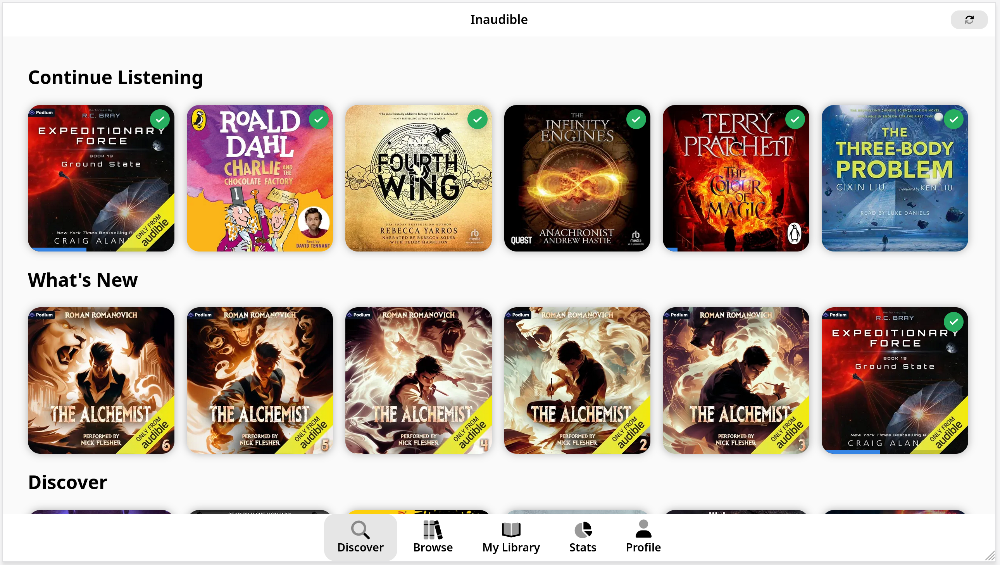
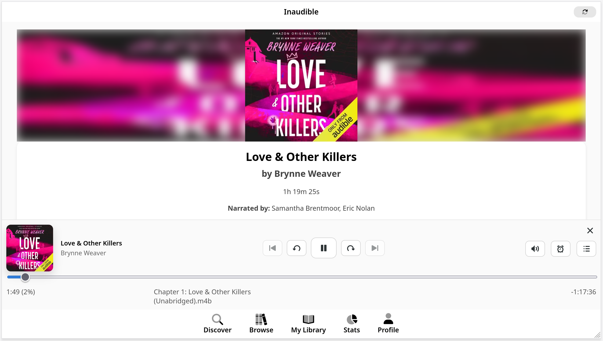
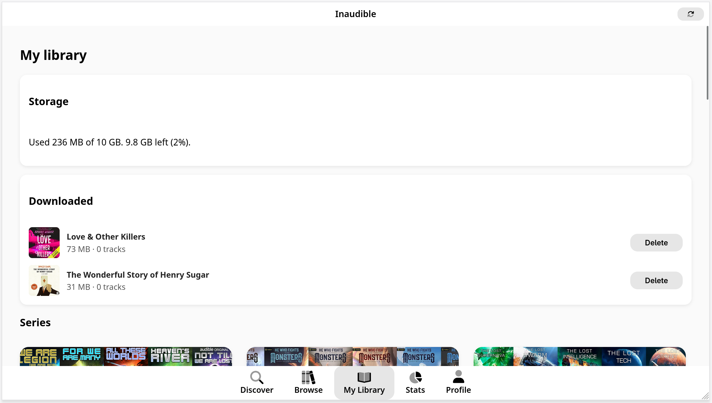
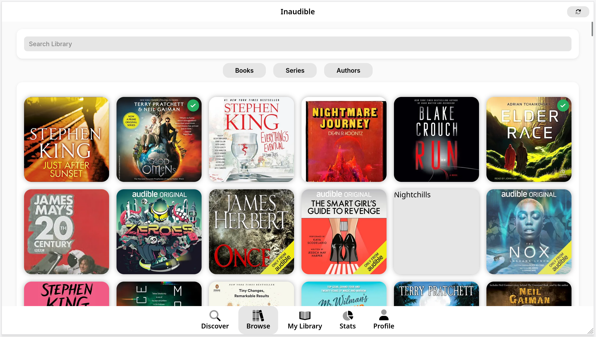
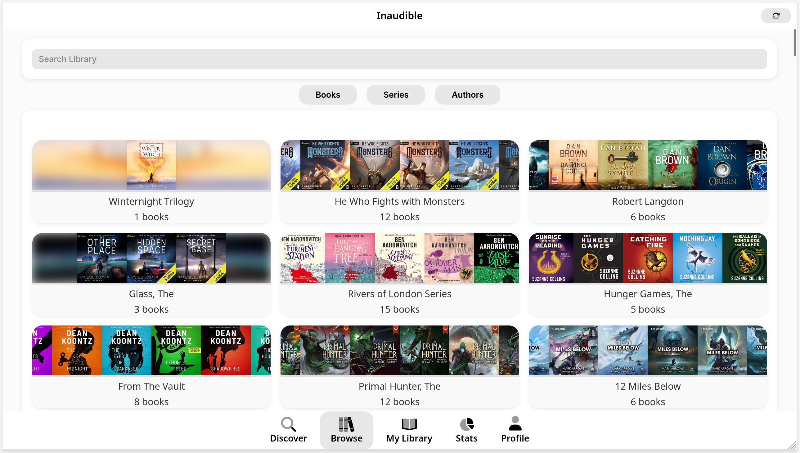
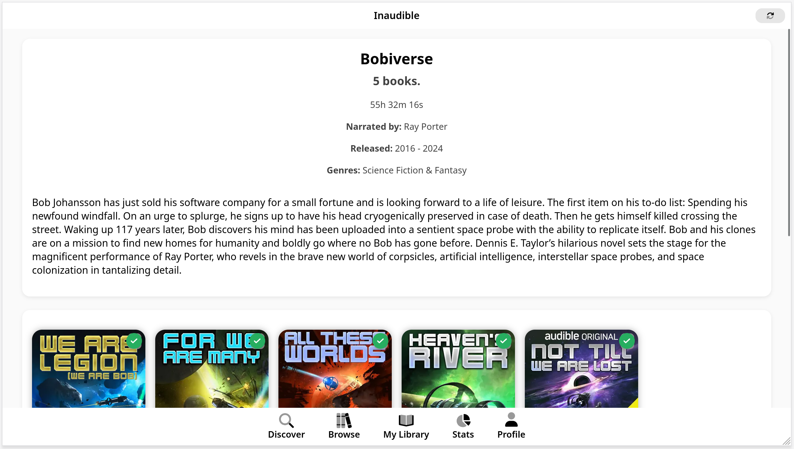
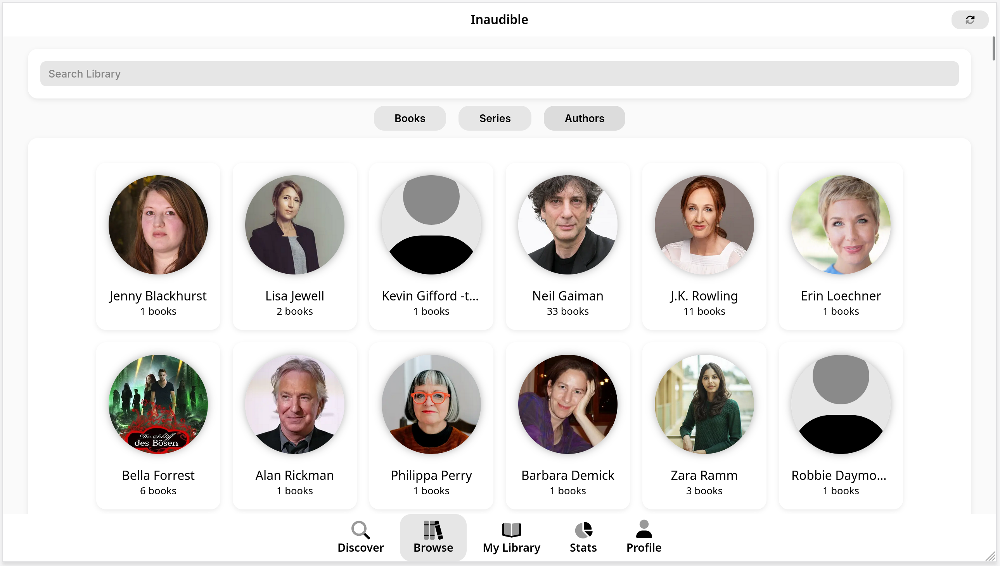
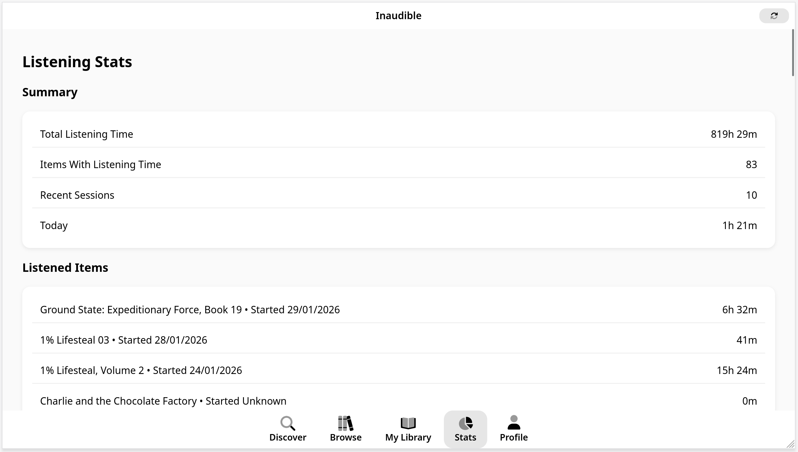

# Inaudible Web

Inaudible Web is an alternative frontend for Audiobookshelf with local caching, offline-friendly metadata, and a built‑in audiobook player.

It is designed to feel significantly faster than the original audiobookshelf frontend after first load and should reduce requests toe the audiobookshelf API long term. 

The project is visually in the style of libadwaita (or a rough representation of).


## AI Statement
This project was written 95% without the use of any AI at all. AI has been used to:
 - Generate this initial readme.
 - Generate the logo svg
 - Fix a bug with playing audiobooks / streaming
 - Fix a bug with audiobook downloads due to the various formats / file layouts possible in audiobookshelf.

There will be AI use in the future - however it will be kept to a minimum as it has been so far.

## Features
- Library browsing: books, series, authors
- Discover view with categories
- Audiobook playing
- Local metadata cache for faster browsing
- "My Library" concept with ability to add items to it that you intend on listening to later.

## Screenshots


















## Requirements

- Node.js 20+
- npm

## Quick Start (Docker Compose)
```sh
services:
  inaudible:
    build:
      context: https://github.com/elliott-parkinson/inaudible-web-react.git
    container_name: inaudible
    environment:
      VITE_ALLOWED_HOSTS: ${VITE_ALLOWED_HOSTS:-""}
      INAUDIBLE_AUDIOBOOKSHELF_API_BASE_URL: ${INAUDIBLE_AUDIOBOOKSHELF_API_BASE_URL:-""}
      DENO_ENV: "production"
```

## Quick Start (Local)

```sh
npm ci
npm run dev
```

- Dev server: `http://localhost:3000`
- Preview server (built app): `http://localhost:5173`

## Build

```sh
npm run build
```

## Preview (Production‑like)

```sh
npm run preview
```

## Environment Configuration

Copy the template and edit as needed:

```sh
cp .env.example .env.local
```

### Supported Variables

 - `INAUDIBLE_AUDIOBOOKSHELF_API_BASE_URL` - Required* - Audiobookshelf api url domain (without /api or /audiobookshelf)
- `VITE_HTTPS_KEY_PATH` — path to dev HTTPS key (optional)
- `VITE_HTTPS_CERT_PATH` — path to dev HTTPS cert (optional)
- `VITE_ALLOWED_HOSTS` — comma‑separated list for `vite preview` host allowlist

Notes:
- Dev HTTPS is enabled only if both cert files exist.
- `VITE_ALLOWED_HOSTS` is used only for `vite preview`.
- Local overrides go in `.env.local` (not committed).

## Docker

### Build Image

```sh
docker build -t inaudible-web .
```

### Run Container

```sh
docker run --rm -p 5173:5173 inaudible-web
```

The container runs:
- `npm run build`
- `npm run preview`

So the app will be available at:
- `http://localhost:5173`

### Notes for Reverse Proxies

If you run behind a reverse proxy (e.g., Caddy, Nginx), set `VITE_ALLOWED_HOSTS` to include the proxy host. Example:

```env
VITE_ALLOWED_HOSTS=your.domain.com
```

## Scripts

- `npm run dev` — dev server on port 3000
- `npm run build` — production build
- `npm run preview` — preview build on port 5173
- `npm run prod` — alias for preview host/port 5173

## Troubleshooting
- HTTPS is required to use the Audible API - so when running in dev or not behind a reverse proxy we need to generate our own certificates. 
- If preview fails behind a proxy, ensure `VITE_ALLOWED_HOSTS` includes the proxy host.
- If dev HTTPS fails, check `VITE_HTTPS_KEY_PATH` and `VITE_HTTPS_CERT_PATH` or remove them to fall back to HTTP.
